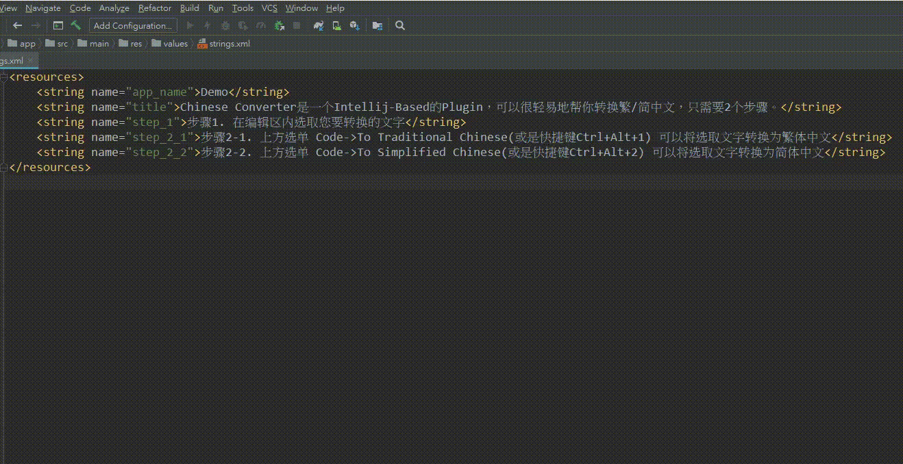
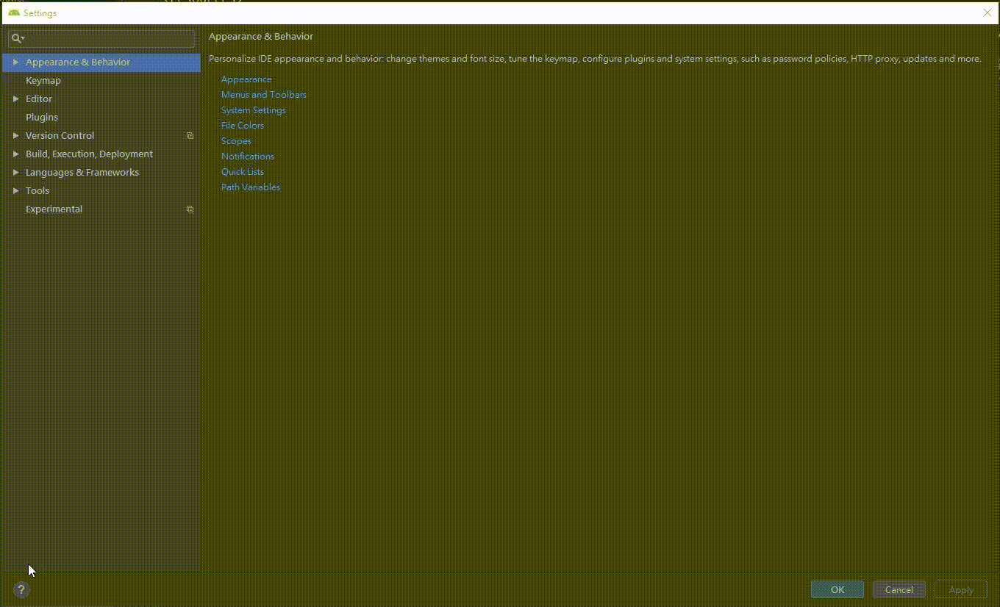

# Chinese Converter

`Chinese Converter` is a tool for translating between Traditional Chinese and Simplified Chinese via hotkeys without any GUI, 
it is more convenient, simple and fast. You can translate easily in just two steps.

## Supported IDEs
+ Android Studio
+ CLion
+ DataGrip
+ GoLand
+ Intellij IDEA Ulimate
+ Intellij IDEA Community
+ Intellij IDEA Educational
+ MPS
+ AppCode
+ PhpStorm
+ PyCharm
+ Professional
+ PyCharm Community
+ PyCharm Educational
+ Rider
+ RubyMine
+ WebStorm

## Demo

## Download

`File`->`Settings`->`Plugins`->`Marketplace`->Search "Chinese Converter"->Install

## Usage

1. Select a piece of text.
2. Press `Ctrl+Alt+1`, the text you selected will be translated into Traditional Chinese, or press `Ctrl+Alt+2` to translate into Simplified Chinese.
